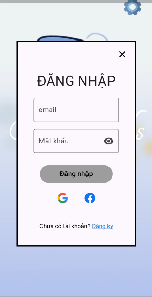
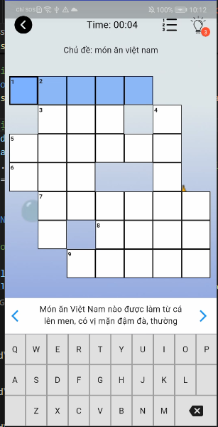
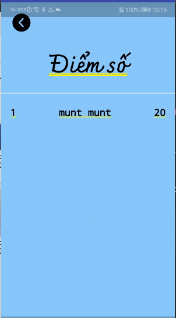
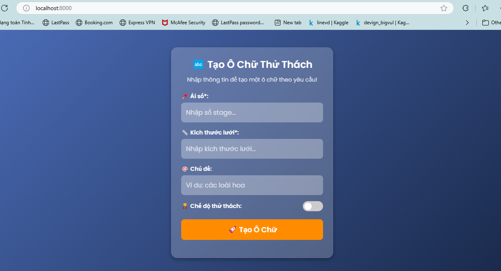

### Giới thiệu chung

**Crossword** là một ứng dụng giải ô chữ thú vị, kết hợp giữa giải trí và rèn luyện tư duy. Repository trình bày một hệ thống Crossword được xây dựng bằng **Flutter** và hệ thống tạo các ải chơi bằng **Python**.

## Phần hệ thống trò chơi
Gồm các chức năng sau:  
- Đăng nhập, đăng ký  
- Chọn chế độ chơi  
- Chọn ải chơi  
- Xem bảng xếp hạng  
- Thực hiện các màn chơi  

---

**Màn hình đăng nhập**  
  

**Màn chơi**  
  

**Xếp hạng**  

## Phần hệ thống tạo ải
Quản trị viên sẽ nhập vào số ải, chủ đề (nếu có), kích thước và chế độ, hệ thống sẽ dựa vào các thông tin được cung cấp để tạo ải theo yêu cầu. Nội dung các ải được tạo thành bởi AI Gemini, hệ sẽ gửi các yêu cầu cho AI, nhận về kết quả xử lý để tạo thành một ải hoàn chỉnh

**Giao diện hệ thống tạo ải**  
 

Các bước chạy hệ thống:
1. Clone repository
2. cd python
3. chạy lệch `python app` trong terminal
4. tạo Terminal mới và chạy `python -m http.server 8000`
5. mở trang web tại `localhost:8000`
