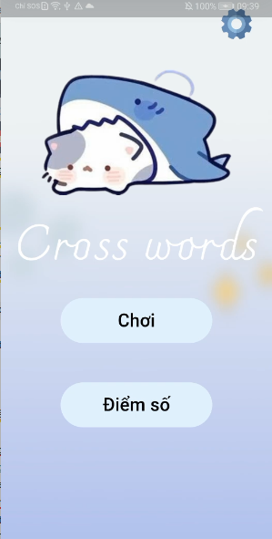
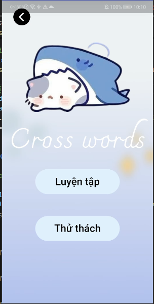
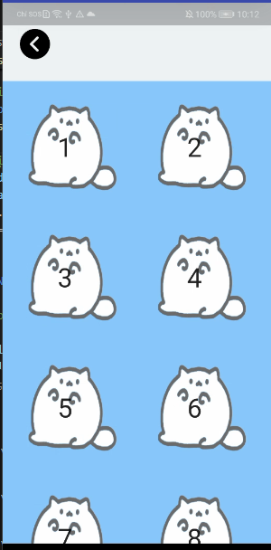

### Giới thiệu chung

**Crossword** là một ứng dụng giải ô chữ thú vị, kết hợp giữa giải trí và rèn luyện tư duy. Repository trình bày một hệ thống Crossword được xây dựng bằng **Flutter** và hệ thống tạo các ải chơi bằng **Python**.

**Phần hệ thống trò chơi**  
Gồm các chức năng sau:  
- Đăng nhập, đăng ký  
- Chọn chế độ chơi  
- Chọn ải chơi  
- Xem bảng xếp hạng  
- Thực hiện các màn chơi  

---

**1️⃣ Màn hình chính**  
  

**2️⃣ Màn hình đăng nhập**  
  

**3️⃣ Chọn cấp độ**  
  

**4️⃣ Chọn màn chơi**  
  

**5️⃣ Màn chơi**  
  

**6️⃣ Xếp hạng**  
  

